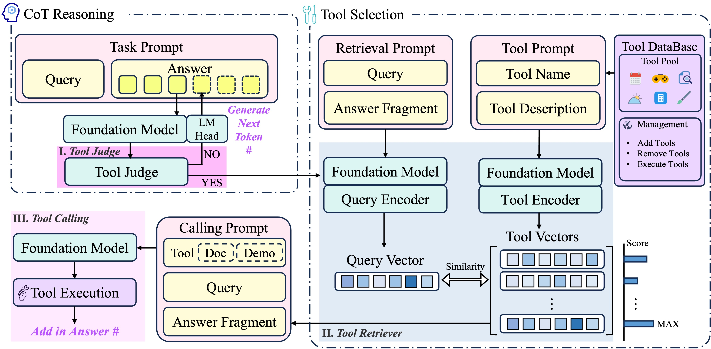

# Chain-of-Tools

📑paper: https://arxiv.org/abs/2503.16779

> [!TIP]
>
> This work was done during 2024S2. Later we found that hidden states of the last layer might not be the best choice. Maybe try the 2/3 position. Hope this gives you some inspiration.

## 🚀 Training

### Environment

python 3.10.13

./requirements.txt

log dir: ./my_log/

checkpoint dir: ./output/

Fill in the LLM checkpoint dir in the config file!

### GSM8K-XL

- Train Judge

python ./src/script/train_gsm8k_judge.py --config_file config/train_judge.yaml

- Train Retriever

python ./src/script/train_gsm8k_retriever.py --config_file config/train_gsm8k_retriever.yaml

- Eval (replace the judge and retriever checkpoint dir in line 30,31)

python ./src/script/test_gsm8k.py --config_file config/test.yaml

### FuncQA

- Train Judge

python ./src/script/train_funcqa_judge.py --config_file config/train_judge.yaml

- Train Retriever

python ./src/script/train_funcqa_retriever.py --config_file config/train_funcqa_retriever.yaml

- Eval (replace the judge and retriever checkpoint dir in line 31,32)

python ./src/script/test_funcqa.py --config_file config/test.yaml

## 🤗 Dataset

https://huggingface.co/datasets/RadiCat/SimpleToolQuestions
